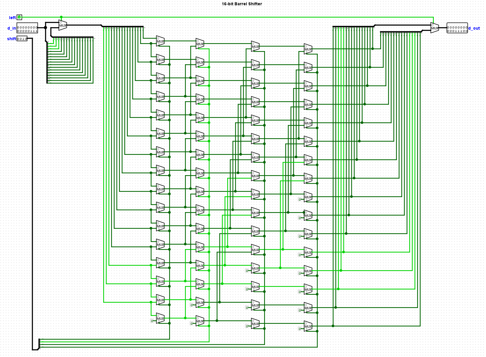

# barrel-shifter-16

16-bit barrel shifter

A barrel shifter allows multiple bit shifts in a single clock cycle using only combinatorial logic.

Tested with TODO: FPGA model, etc.

I made this to learn the basics of running VHDL on an FPGA.
I also plan on using a barrel shifter in my homebrew CPU project so I needed to figure out how this circuit works.

## Circuit

66 2x1MUX

Logisim Evolution circuit [barrel_shifter.circ](./barrel_shifter.circ)

## References

- https://en.wikipedia.org/wiki/Barrel_shifter
