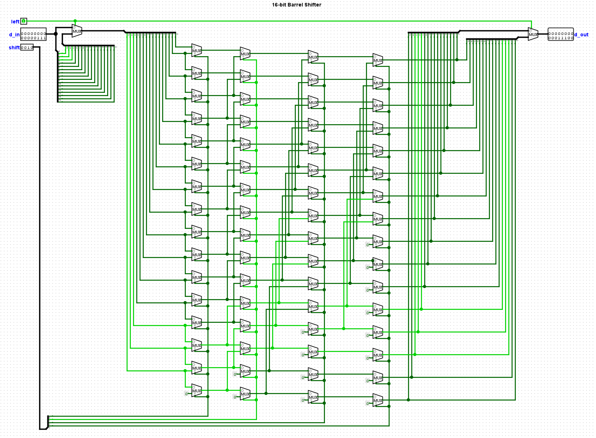

# barrel-shifter-16

16-bit barrel shifter

A barrel shifter allows multiple bit shifts in a single clock cycle using only combinatorial logic.

Synthesized in Vivado and tested on 
[Basys 3 Artix-7](https://digilent.com/shop/basys-3-artix-7-fpga-trainer-board-recommended-for-introductory-users/) 
(XC7A35TCPG236-1).

I made this to learn the basics of running VHDL on an FPGA.
I also plan on using a barrel shifter in my homebrew CPU project so I needed to figure out how this circuit works.

## Circuit

66 2x1MUX

Logisim Evolution circuit [logisim/barrel_shifter.circ](logisim/barrel_shifter.circ)

## References

- https://en.wikipedia.org/wiki/Barrel_shifter
- https://digilent.com/reference/programmable-logic/basys-3/start
  - https://digilent.com/reference/_media/reference/programmable-logic/basys-3/basys-3-sch-public-rev-d.pdf
- https://github.com/Digilent/digilent-xdc/blob/master/Basys-3-Master.xdc
